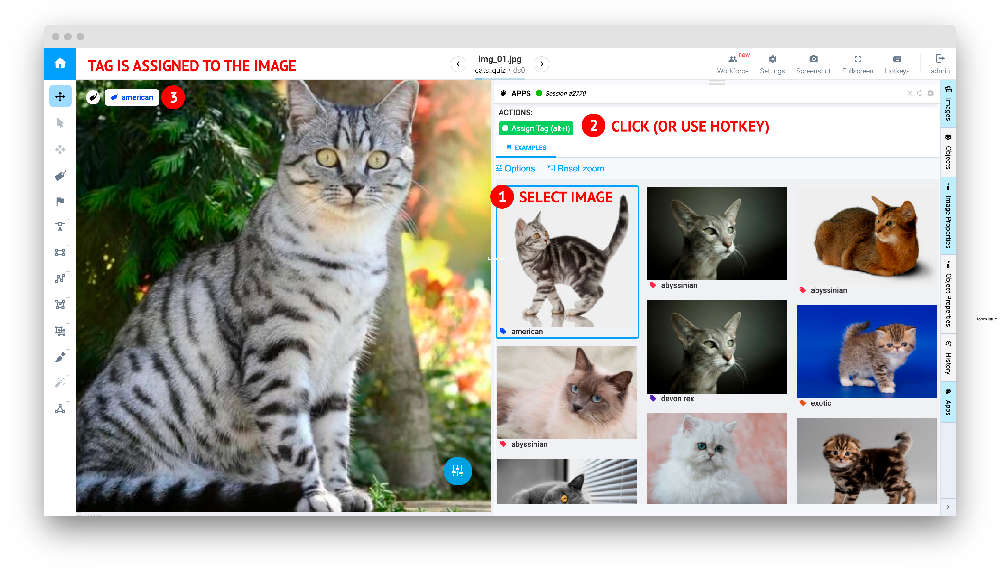
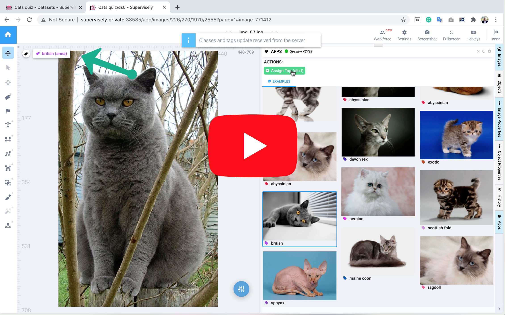
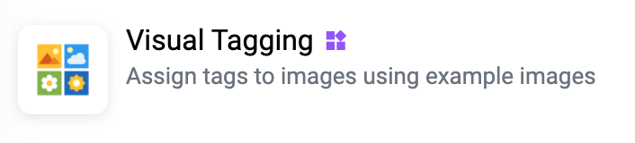
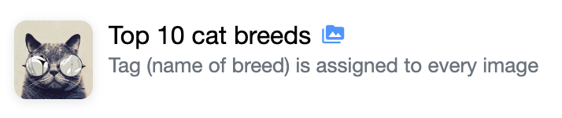
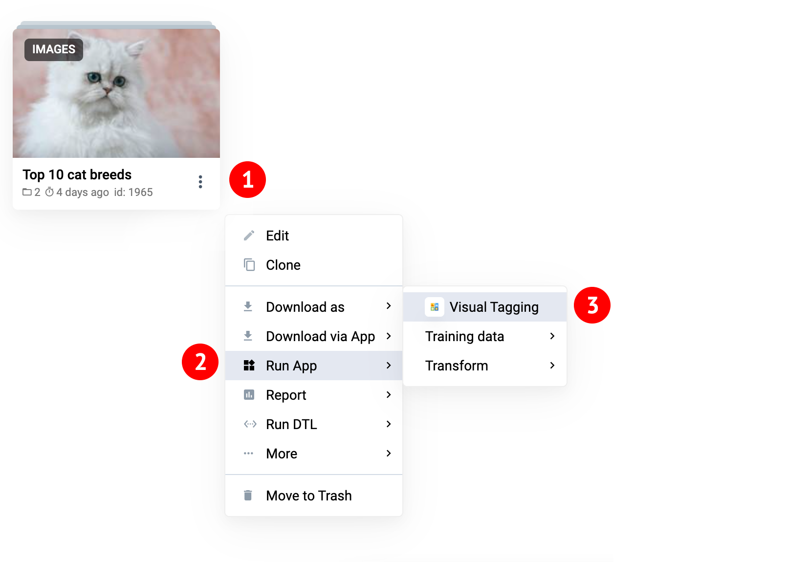
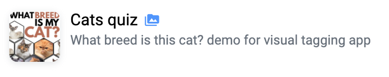
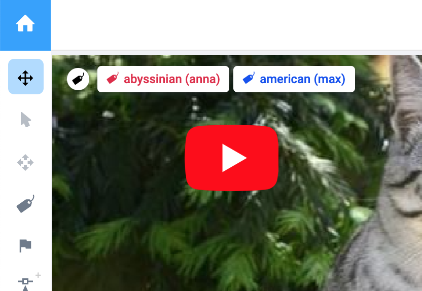

# Visual Tagging

  <a href="#Overview">Overview</a> •
  <a href="#How-To-Use">How To Use</a>

# Overview

Assign tag using visual examples (one or more) in labeling interface.

# How To Use

1. Add app from ecosystem to your team

   

2. Prepare input project. Assign tags to images. They will be used as examples. Tag may have several examples. You can try ready to use example project`top-10-cat-breeds` from ecosystem.
   

3. Run app from the context menu of the project that was created on previous step

4. Open any project with images in labeling interface and open app session. You can use `Cats Quiz` project as a toy example for tests.

5. Do not forget to stop the running session (on `Team Apps` page) once you finished with it. Go to Team 

**Notice**: To use app in labeling job, it is needed to run separate app session for every user. Also, it is needed to enable `Multiple tags mode` in the settings of working project.

